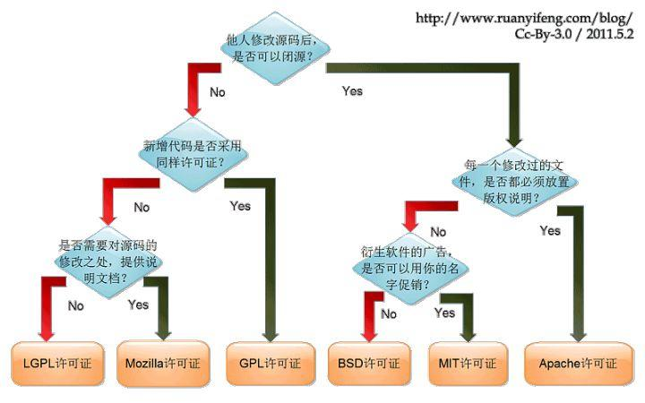

# GitHub

## 1. GitHub Licenses

You can directly refer to this flowchart to judge use which licenses:

|          Licenses          |                          Permission                          |                          Constrains                          |       Others       |
| :------------------------: | :----------------------------------------------------------: | :----------------------------------------------------------: | :----------------: |
|            None            |                             None                             |                              -                               |         -          |
|         GNU GPLv3          | Individual Usage; Comercial Usage; Paten Award; Duplication Delivery; Alteration | Forced open source; Copyright reserve; Alteration Declaration; Forbidden change license | Author's exemption |
|        MIT License         | Individual Usage; Comercial Usage;  Duplication Delivery; Alteration |                      Copyright reserve                       | Author's exemption |
|     Apache License 2.0     | Individual Usage; Comercial Usage; Paten Award; Duplication Delivery; Alteration | Copyright reserve; Alteration Declaration; Forbidden trademark usage | Author's exemption |
|        BSD 2-Clause        | Individual Usage; Comercial Usage;  Duplication Delivery; Alteration |                      Copyright reserve                       | Author's exemption |
|        BSD 3-Clause        | Individual Usage; Comercial Usage;  Duplication Delivery; Alteration |     Copyright reserve; Author Info forbids promte sales      | Author's exemption |
| Eclipse Public License 2.0 | Individual Usage; Comercial Usage; Paten Award; Duplication Delivery; Alteration | Forced open source; Copyright reserve; Alteration Declaration; Forbidden change license | Author's exemption |
|         GNU AGPLv3         | Individual Usage; Comercial Usage; Paten Award; Duplication Delivery; Alteration | Forced open source; Copyright reserve; Alteration Declaration; Forbidden change license; Network Server need to display entire source code | Author's exemption |
|         GNU GPLv2          | Individual Usage; Comercial Usage;  Duplication Delivery; Alteration | Forced open source; Copyright reserve; Alteration Declaration; Forbidden change license | Author's exemption |
|        GNU LGPLv2.1        | Individual Usage; Comercial Usage;  Duplication Delivery; Alteration | Forced open source; Copyright reserve; Alteration Declaration; Forbidden change license (Derived Library) | Author's exemption |
|         GNU LGPLv3         | Individual Usage; Comercial Usage; Paten Award; Duplication Delivery; Alteration | Forced open source; Copyright reserve; Alteration Declaration; Forbidden change license (Derived Library) | Author's exemption |
| Mozilla Public License 2.0 | Individual Usage; Comercial Usage; Paten Award; Duplication Delivery; Alteration | Forced open source; Copyright reserve; Alteration Declaration; Forbidden change license (Documents) | Author's exemption |
|       The Unlicense        | Individual Usage; Comercial Usage; Duplication Delivery; Alteration |                              -                               | Author's exemption |

> [Ref]: https://www.pianshen.com/article/81881250046/

